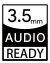

<h1 align="center"><b>3.5mm READY</b></h1>

3.5mm READY Certification

## Get Started

1. Design a hardware, software or anything else and put a 3.5mm headphone jack connector, algorithm support or anything you want to.
2. Put this certification icon and place it in your project.
3. Add your project to [Certification_Lists.md](certifications/Certification_Lists.md)
4. Enjoy its supreme advanced audio experience.

## License of this Certification

Creative Commons Zero v1.0 Universal

